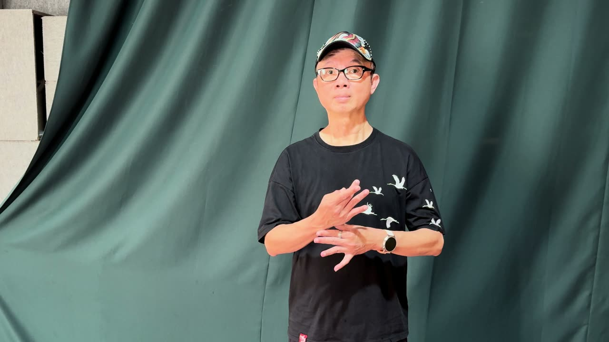
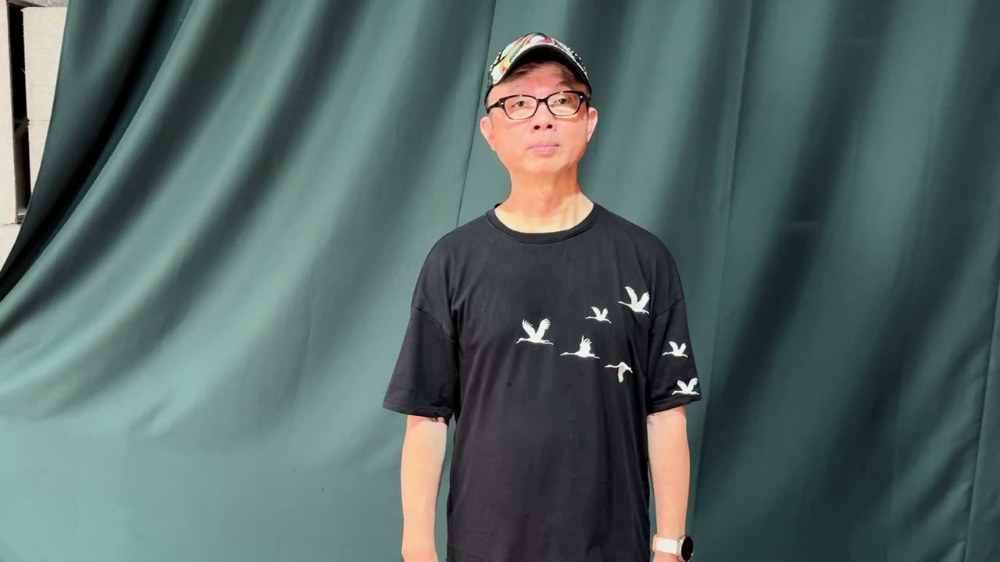
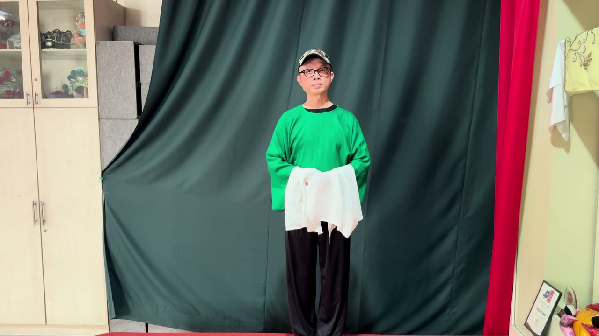
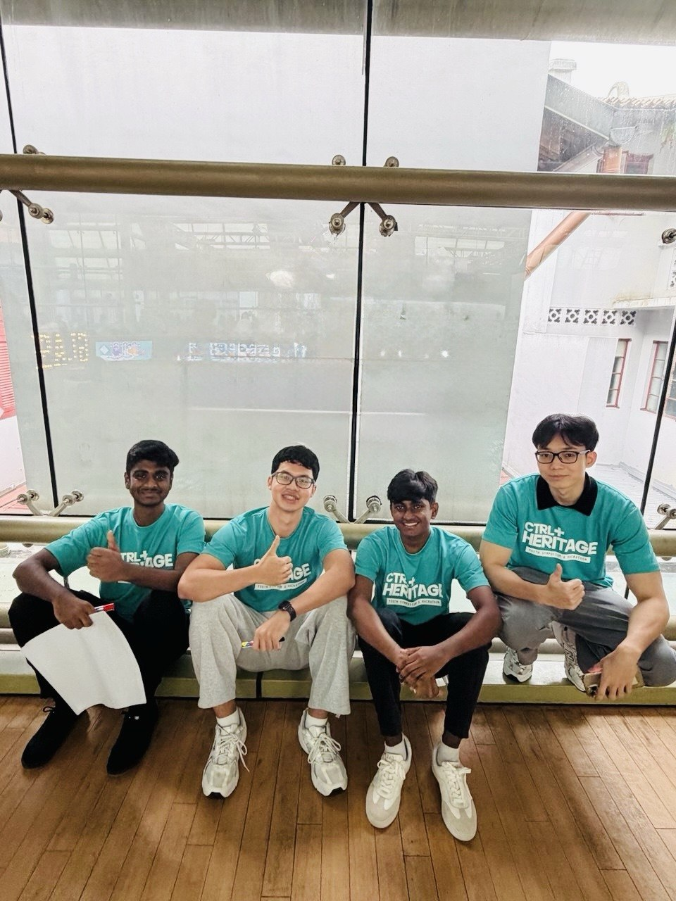

# Opera Hero

An offline, browser-based Cantonese opera movement game powered by real-time pose and
hand tracking.

Opera Hero was a winning project at the **CTRL+ Heritage Youth Symposium and
Hackathon 2026**. The team subsequently received **S$5,000 in implementation funding**
to develop the concept for deployment as an unmanned public festival experience.

Visitors watch three practitioner demonstrations—Orchid Finger, Opening Door, and
Water Sleeves—then perform each movement in front of a camera. Opera Hero follows the
visitor in real time, compares the movement with practitioner-derived references, and
returns supportive scores and cultural context.

## The three movements

| Orchid Finger | Opening Door | Water Sleeves |
|:---:|:---:|:---:|
|  |  |  |

## Highlights

- Real-time pose and two-hand landmark detection with MediaPipe
- Low-latency inference in a Web Worker so vision processing does not block the UI
- Interpretable landmark-based scoring with normalized body geometry and dynamic time
  warping
- Practitioner-derived reference fixtures and deterministic replay tests
- Guided calibration, framing feedback, automatic attempt capture, and tracking-loss
  recovery
- A live visitor mirror with a landmark-anchored Cantonese opera costume overlay
- Responsive touchscreen-friendly flow designed for an unmanned public booth
- Fully local processing: camera frames are not uploaded, recorded, or stored
- Offline runtime assets, including vision models and demonstration clips

## Technology

- React 19 and TypeScript
- Vite
- MediaPipe Tasks Vision
- Web Workers, WebAssembly, Canvas, and `ImageBitmap`
- Vitest and Testing Library
- Playwright
- GitHub Actions across Windows, macOS, and Linux

## How it works

```text
Camera
  -> bounded ImageBitmap capture
  -> MediaPipe pose + hand inference in a Web Worker
  -> normalized landmarks
  -> gesture-specific feature extraction
  -> temporal alignment and similarity scoring
  -> gameplay state machine and visitor feedback
```

Inference and scoring run locally in the browser. The application does not require a
backend, account, database, or internet connection after dependencies have been
installed.

## Run locally

### Prerequisites

- [Node.js](https://nodejs.org/) **22.13.0 or newer**
- npm
- Google Chrome
- An integrated or USB webcam

### Installation

```bash
git clone https://github.com/minwaiphyo/opera-hero.git
cd opera-hero
npm install
npm run dev
```

Open the URL printed by Vite—normally
[`http://127.0.0.1:5173/`](http://127.0.0.1:5173/)—in Google Chrome and allow camera
access when prompted.

For a deterministic installation matching `package-lock.json`, use `npm ci` instead
of `npm install`.

### Using an external webcam

1. Connect the USB webcam before starting the game.
2. Open [`http://127.0.0.1:5173/lab/camera`](http://127.0.0.1:5173/lab/camera).
3. Select the webcam under **Available camera** and verify the preview.
4. Return to the root URL.

The preference is stored in the browser on that computer. If the selected camera is
unavailable later, Opera Hero falls back to another available camera.

## Production build

```bash
npm run build
npm run preview
```

The optimized static application is written to `dist/`. The preview command serves it
on loopback, normally at `http://127.0.0.1:4173/`.

## Development tools

The visitor experience is served at `/`. Diagnostic surfaces are intentionally
available only through their URLs:

| Route | Purpose |
|---|---|
| `/` | Complete Opera Hero visitor experience |
| `/baseline` | Browser and hardware capability checks |
| `/lab/camera` | Camera selection, landmarks, latency, and stability diagnostics |
| `/lab/landmarks` | Deterministic practitioner and synthetic fixture replay |

## Verification

```bash
npm run typecheck
npm run lint
npm test
npm run build
npm run test:e2e
```

Run `npm run build` before the end-to-end suite because the Playwright smoke tests
serve the production bundle. The end-to-end configuration uses an installed Google
Chrome browser.

Useful alternatives:

```bash
npm run test:watch
npm run preview
```

## Repository structure

```text
src/
├─ app/                 Application entry point and diagnostic routes
├─ camera/              Camera lifecycle, selection, constraints, and recovery
├─ domain/gestures/     Feature extraction, reference envelopes, and scoring
├─ gameplay/            Visitor flow, runtime orchestration, and presentation
├─ labs/                Camera and landmark developer laboratories
├─ platform/            Browser capability checks
└─ vision/              Worker inference, adapters, diagnostics, and replay

public/
├─ guides/              Visitor-facing practitioner demonstrations
├─ models/              Local MediaPipe pose and hand models
├─ overlays/            Costume artwork
└─ team/                Team photograph

docs/project-tracking/  Architecture, roadmap, decisions, and verification evidence
scripts/                Practitioner-fixture and guide-generation tooling
tests/e2e/              Chrome smoke tests
```

## Scoring approach

Opera Hero does not train a pixel-based classifier on visitors. It extracts pose and
hand landmarks, normalizes measurements using body-relative geometry, derives
gesture-specific motion signals, and aligns an attempt with a practitioner reference
over time. This makes the scoring behavior interpretable and avoids learning the
recording background, lighting, or the practitioner's appearance.

Each gesture uses the signals that remain reliable for that movement. For example,
Water Sleeves emphasizes pose and arm trajectories because the costume can obscure
the hands. The scoring is intentionally encouraging: it measures visible similarity,
not cultural mastery or artistic skill.

More detail is available in
[`SCORING_DATA_PIPELINE.md`](./docs/project-tracking/SCORING_DATA_PIPELINE.md) and
[`ARCHITECTURE.md`](./docs/project-tracking/ARCHITECTURE.md).

## Privacy and offline operation

- Camera frames stay in memory and are processed locally.
- The application does not upload or retain visitor video or photographs.
- Raw practitioner footage is excluded from the repository.
- Only cleared visitor-facing guide clips and derived landmark fixtures are committed.
- The game can run without network connectivity after installation.

## Engineering documentation

- [Architecture](./docs/project-tracking/ARCHITECTURE.md)
- [Scoring data pipeline](./docs/project-tracking/SCORING_DATA_PIPELINE.md)
- [Hardware baseline](./docs/project-tracking/hardware-baseline.md)
- [Verification evidence](./docs/project-tracking/verification/)

## Creators



- [Mani Kumar Prateek](https://www.linkedin.com/in/prateek-abc12/) — NUS Computer Science
- [Min Wai Phyo](https://www.linkedin.com/in/min-wai-phyo/) — NUS Computer Science and Business Administration
- [Stalin Muthukumar Bill Sujith Kumaar](https://www.linkedin.com/in/bill-sujith-kumaar/) — NUS Computer Science
- [Kaung Khant Minn](https://www.linkedin.com/in/kaung-khant-minn21/) — NUS Computer Science

Built for the CTRL+ Heritage Youth Symposium and Hackathon 2026.
